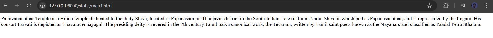
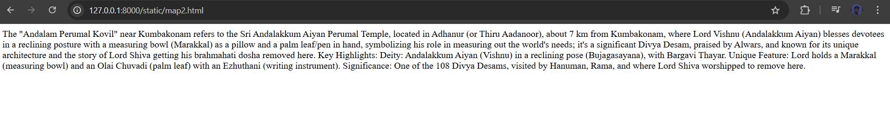

# Ex04 Places Around Me
## Date: 12/12/2025
## Ref No:25007375

## AIM
To develop a website to display details about the places around my house.

## DESIGN STEPS

### STEP 1
Create a Django admin interface.

### STEP 2
Download your city map from Google.

### STEP 3
Using ```<map>``` tag name the map.

### STEP 4
Create clickable regions in the image using ```<area>``` tag.

### STEP 5
Write HTML programs for all the regions identified.

### STEP 6
Execute the programs and publish them.

## CODE
~~~
<html>
<body>

</html><!-- Image MapNearMe/lokesh/mapapp/static/Generated by http://www.image-map.net/ -->


<map name="image-map">
    <area target="" alt="temple1" title="temple1" href="map1.html" coords="313,702,369,765" shape="rect">
    <area target="" alt="temple2" title="temple2" href="map2.html" coords="1088,782,50" shape="circle">
    <area target="" alt="temple3" title="temple3" href="map3.html" coords="1019,193,1061,239" shape="rect">
    <area target="" alt="temple4" title="temple4" href="map4.html" coords="1171,105,64" shape="circle">
</map>
</body>
</html>  

map1.html

<html>
<body>
 Palaivananathar Temple is a Hindu temple dedicated to the deity Shiva, located in Papanasam, in Thanjavur district in the South Indian state of Tamil Nadu. Shiva is worshiped as Papanasanathar, and is represented by the lingam. His consort Parvati is depicted as Thavalavennayagal. The presiding deity is revered in the 7th century Tamil Saiva canonical work, the Tevaram, written by Tamil saint poets known as the Nayanars and classified as Paadal Petra Sthalam.
</body>
</html>

map2.html

<html>
<body>
The "Andalam Perumal Kovil" near Kumbakonam refers to the Sri Andalakkum Aiyan Perumal Temple, located in Adhanur (or Thiru Aadanoor), about 7 km from Kumbakonam, where Lord Vishnu (Andalakkum Aiyan) blesses devotees in a reclining posture with a measuring bowl (Marakkal) as a pillow and a palm leaf/pen in hand, symbolizing his role in measuring out the world's needs; it's a significant Divya Desam, praised by Alwars, and known for its unique architecture and the story of Lord Shiva getting his brahmahati dosha removed here. 
Key Highlights:
Deity: Andalakkum Aiyan (Vishnu) in a reclining pose (Bujagasayana), with Bargavi Thayar.
Unique Feature: Lord holds a Marakkal (measuring bowl) and an Olai Chuvadi (palm leaf) with an Ezhuthani (writing instrument).
Significance: One of the 108 Divya Desams, visited by Hanuman, Rama, and where Lord Shiva worshipped to remove here.
</body>
</html>

map3.html

<html>
<body>
The Ezhuthari Shiva Temple is the Innambur Ezhutharinathar Temple, located near Kumbakonam in Innambur village, known for its self-manifested Shiva Lingam and believed to help with learning, education, and curing speech impediments, where priests write on children's tongues with paddy grains, and it's significant for Sun God worship, with unique features like Gajaprashta Vimana (elephant-shaped roof) and shrines for Nithya Kalyani (Parvati). 
</body>
</html>

map4.html

<html>
<body>
The most famous Durga Amman temple near Kumbakonam is the Patteeswaram Durga Devi Temple, located in Patteeswaram (about 10 km away), part of the larger Thenupuriswarar Temple complex, known for removing obstacles, especially for marriage, with special pujas available online. Another significant spot is the Kathiramangalam Vana Durga Temple, further away, dedicated to Vana Durga. 
</body>
</html>
~~~

## OUTPUT




## RESULT
The program for implementing image maps using HTML is executed successfully.
